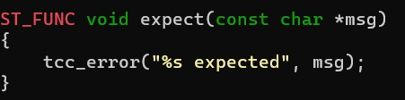
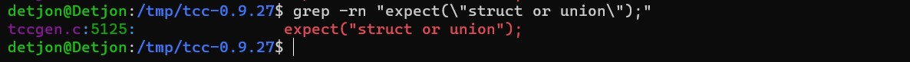

# **Auto Dereferencing Dot (.) Operator in C**

## **Introduction**

During my experiences with C, I have come across many situations and faced many problems. Here I'm going to share some details about the problems I faced using structures, unions, and pointers.

I'm going to describe the problems with the following:

- Accessing members of a struct
- Accessing members of pointer to a struct

To access members of a structure we use the dot (.) operator and arrow (->) operator when it's a pointer to a structure. Arrow operator was introduced in 1975 and back then its purpose was different. Previously, it was dereferenced using the \* operator and it was accessed using the dot (.) operator (*ptr).member (According to the Original C Reference Manual). We are going to discuss more this in the following sections

It was very difficult for me to understand how to access the members of the struct. Also, pointers were confusing to me at that time. I always forgot how to use them and access the members of the struct they are pointing to.

I wasn't the only one who faced these problems. It was a problem for many other students as well. When I was mentoring First-Year Students, I came across the question "Why can't I access struct members only using the dot (.) operator?". I also read some posts and comments on the internet that mentioned the same thing which gave me an idea. This feature is also implemented in languages like Rust and Go.

More about this will be discussed below in this section.

Below I described how the access is made in practice.

**Let's consider the following struct example:**

```c
typedef struct {
    int id;
    char name[20];
    int age;
} Student;
```

Here we declared a struct named Student. The struct contains three members (fields), id, name, and age. The id is an integer, name is a string (to be more precise it's an array of chars with a length of 20, including the string terminator character '\0' at the end) and the age is an integer.

**So how do we access the members of the struct?**

```c
// Declaring a identifier with the type of the struct Student
Student student;
// Updating the members of the struct
student.id = 1;
student.name = "Detjon";
student.age = 20;
```

In the above example I have declared a struct named student and then updated the values of the struct members, but how did I access them?
In this case, I've used the dot operator (.) and then assigned a value to the members of the struct.

**So let's take a look for the case when we have a pointer to the struct.**

***First Method:***

```c
// Declaring and initializing a pointer to the struct Student
Student *student = (Student *)malloc(sizeof(Student));
// Updating the members of the struct
(*student).id = 1;
(*student).name = "Detjon";
(*student).age = 20;
```

In the above example, I have declared a pointer to the struct named student and then updated the members of the struct. To access the members of the struct, I have used the dot operator (.), but first, I dereferenced the pointer to the struct and put it inside the parentheses because of operator precedence. The precedence of the dot operator is higher than the precedence of the \* (Indirection, dereference) operator.

***Second Method:***

```c
// Declaring and initializing a pointer to the struct Student
Student *student = (Student *)malloc(sizeof(Student));
// Updating the members of the struct
student->id = 1;
student->name = "Detjon";
student->age = 20;
```

In the above examples, I have declared a pointer to the struct named student and then updated the members of the struct. To access the members of the struct, I have used the arrow operator (->) which is used when we access members of the structures through pointers.

**Is there another way of accessing members of pointers to structures?**

In the above examples we saw different ways to access the members of the struct for different cases in different ways. All the methods in the above examples are valid and the only difference is the way we access the members, so you can use whichever method you want.

Let's consider the following example:

```c
// Declaring identifier stud with the type of the struct Student
Student stud;
// Declaring and initializing a pointer to the struct Student
Student *student = (Student *)malloc(sizeof(Student));

// Updating the members of the struct stud using the dot operator
stud.id = 1;
stud.name = "Detjon";
stud.age = 20;

// Updating the members of the struct student using Auto Dereferencing Dot Operator
student.id = 1;
student.name = "Detjon";
student.age = 20;
```

We see that they use the dot (.) operator to access the members of the struct. The only difference is that in the first example, we used the dot operator to access the members of the struct stud and in the second example, we used it to access the members of student, which is a pointer to a struct.

**Is that valid? If so, why?**

The answer is no, it's not valid (for most legacy compilers it will be considered as an error), but would it be cool if that was possible? If yes, how would we do it and why?

I used to forget to use arrow operator (->) for accessing a member of pointers to structs and instead used dot operator (.). The compiler always yelled at me, which helped me to understand the problem. They are both smart and precise most of the time since they showed me the exact problem and the solution to that problem.


In the above picture, it's obvious that the compiler is complaining about the error and I decided to patch the compiler, so that it won't consider the code as erroneous anymore. I will refer to this feature as "Auto Dereferencing Dot Operator".

**Why C doesn't have The "Auto Dereferencing Dot Operator"?**

The question is why the C committee didn't implement it. Is there any problem? If so what are the reasons?
In the next section, I will discuss how we can make it possible and the pros and cons of doing so.

## **Implementation**

So after I did a quick introduction now it's time to implement the "Auto Dereferencing Dot (.) Operator". Well okay, but where do we start?
First, we are going to set up the TCC compiler and test if it works.

### **Disclaimer:**

***I'm using TCC because it is light and easy to understand. It is also fast and safe. Check the references for more. You can use any other open-source compiler, but implementation steps may be different. Also, the operating system that I'm working with is "Ubuntu 20.04.3 LTS". The steps required to do this implementation may not be the same. I suggest using any Debian-based OS or following the steps below carefully and try to understand them so you will be able to find an approach.***

### **Setting up Tiny C Compiler**

First, we download the TCC compiler from [here](http://download.savannah.gnu.org/releases/tinycc/).

Use the commands below to download the compiler and extract it to the current directory.

```console
wget http://download.savannah.gnu.org/releases/tinycc/tcc-0.9.27.tar.bz2
tar xvf tcc-0.9.27.tar.bz2 && cd tcc-0.9.27
```

A folder named tcc-0.9.27 will be created. We open it and we see that we have a configuration file and a make file. Before doing anything else, I suggest you run the following commands to make sure that we have everything set up for the compilation. Let's install development tools.

Start by updating and upgrading the system.

```console
sudo apt-get update && sudo apt-get upgrade
```

Then install the development tools and libraries.

```console
sudo apt-get install build-essential libncurses5-dev libgmp-dev libmpfr-dev libmpc-dev
sudo apt-get install autoconf automake gdb git libffi-dev zlib1g-dev libssl-dev
sudo apt-get install texinfo
```

There can be other dependencies that your environment is missing. Make sure you have installed all of them before you start with the next steps.

The next step is to build the compiler and install it somewhere because we may face some linking errors.

First, we will bootstrap the compiler using `gcc` that is already installed in the system and is the default compiler used in `configure` file, and later on, the compiler will be able to build itself.

Follow the steps below to build the compiler. Make sure you are at the directory where we extracted the compiler and you got the right permissions.

```console
./configure
make
make install
```

When executing the above command you may face some errors. Probably some missing dependencies. Try to fix them and then run commands again and continue with the rest of the steps.

You can add other flags to the `./configure` if needed. Check them by executing with the `--help` flag.

#### **Testing TCC Compiler**

After setting up the compiler let's compile a simple Hello World program.

```c
#include <stdio.h>

int main(void) {

    printf("Hello World!\n");

    return 0;
}
```

We first compile it and then run it to see if it works.

```console
tcc hello.c -o hello
./hello
```

We see that it perfectly works.
Now let's see if the compiler can build itself.

```console
./configure --cc=tcc --prefix=/usr/local/tcc-test
make
make install
```

I checked `--help` flag and I saw that `'--cc'` flag is used to specify the compiler to use. By default, it uses the `gcc` so I switched to `tcc` (remember that we first bootstrapped it using `gcc`). I also changed the prefix so we can install it somewhere else and keep the compiler that was bootstrapped by gcc. We can test it by compiling anything with `/usr/local/tcc-test/bin/tcc`.

```console
/usr/local/tcc-test/bin/tcc main.c -o main
```

Now that the compiler can build itself we can start with the implementation.

### **How do we do the implementation?**

I started by compiling the code below using TinyC compiler. You can also find `main.c` file in the repository.

```c
#include <stdio.h>

typedef struct
{
    int f1, f2;
} Foo;

void sum(Foo *foo)
{

    ///! Assigning a value to struct fields
    foo->f1 = 69;
    foo->f2 = 911;

    ///! Print the sum of foo fields
    printf("%d\n", foo->f1 + foo->f2);
}

void _sum(Foo *foo)
{

    ///! Assigning a value to struct fields
    foo.f1 = 69;
    foo.f2 = 911;

    ///! Print the sum of foo fields
    printf("%d\n", foo.f1 + foo.f2);
}

int main(void)
{

    ///! Defined struct foo with Type Foo
    Foo foo;

    ///! Calling the function sum with the address of foo as an argument
    ///! This function will add the values of f1 and f2 and print the sum
    ///! It will access struct fields with member access operator '->' in the regular way (not Auto Dereferencing with dot operator)
    sum(&foo);

    ///! Calling the function _sum with the address of foo as an argument
    ///! This function will add the values of f1 and f2 and print the sum
    ///! It will access struct fields with member access operator '.' using Auto Dereferencing with dot operator Patch
    ///! This feature is available only for the Tiny C Compiler with my patch
    ///! The compiler patch it's backward compatible with the legacy code, but the codes that use 'Auto Dereferencing' with dot operator can't be compiled with the legacy compilers
    _sum(&foo);

    return 0;
}
```

As expected, the compiler gave us an error.

```console
main.c:23: error: struct or union expected
```

#### **Let's try to understand the error message.**

This was a little bit confusing since I was used to other compilers in which the error message differs.
They usually display the line of the error and the error message including the solution to that error. (Referring to the picture in the introduction section). Since TinyC compiler is light it didn't give us many clues about the error and only displayed the first error that occurred and not the rest.

It says "struct or union expected" in line 23. We see that there we have tried to access a pointer to a struct using the dot operator which is not allowed yet. The dot operator accepts only lvalue variables type of structs and unions as the left operand, but in our case is a pointer to a struct.

#### **Why do we need the error message?**

The reason behind this is quite simple actually. I believe that the place where this compilation error is handled is the place that we have to change for implementing Auto Dereferencing Dot (.) Operator.

#### **How do we find where this error is handled?**

We understood the error, so let's find where this error is handled.

Let's grep the error in the source code, assuming that it's just a function call with this message that prints it.

```console
grep -rn "struct or union expected"
```

As I expected we got nothing, so this means the error message is either tokenized and then constructed as some sort of bitmask (when each bit represents the status of the expected types and then constructed to string by some sort of a function) or it is passed directly to a function that will accept the expected type.

I guess it's going to be something like this:

```c
types_expected_mask = (TYPE_STRUCT | TYPE_UNION);
printf("%s expected", to_string(types_expected_mask));
```

So let's grep it to find that place in the source code.

```console
grep -rn " expected"
```

The output for the above command:


We got pretty interesting results. The file that we are looking for may be `tccpp.c` which contains the function definition that prints the error messages for the cases we have type mismatch. It takes an argument that is the expected type and prints the error message calling another function named `tcc_error`.



So now it's going to be easier to find the function call that prints the error message. Let's considered the cases explained above

- The message accepted by this function is tokenized and constructed by some sort of bit masking
- The message is passed as it is to the function

In the `expect` function I don't see any sort of bit masking or any kind of string concatenation for the types, but I may be wrong. Mabe it is done when passing the message to the function.

I can `grep` the code for some sort of macros that will contain the expected types or maybe the operator tokens which are parsed by the compiler (arrow, dot, etc).

Let's not complicate it and just grep for the `expect` function calls so we can see what arguments are usually passed to this function. We know for sure that it is a string, but let's verify if it is constructed or not before passing to it.

```console
grep -rn "expect("
```

We got the following results:


As we can see there is no bitmask or something like that, it is called directly with a string that contains expected types. Let's grep exactly the function call when we pass `"struct or union"`.

```console
grep -rn "expect(\"struct or union\");"
```

We got the following results:



It is the only line of code that contains the `expect("struct or union");`, but I'm skeptic. To be sure I changed the messages and then rebuild the compiler using `make -B` to rebuild everything. I got the same line that we wrote there. This means we are in the right direction.


The error is being handled in the `tccgen.c` file and 'expect' function with that message is being called in line `5125`. It is obvious since this file is a generator that is responsible for dealing with programming language semantics and many other things. Check the references for more information.

### **Understanding the source code**

The picture below shows the source code that we found above. It is responsible for checking the type of the parsed token and determining what to do with it.


I'm going to focus only on the lines of codes that are responsible for detecting the type of token that we are interested in. For the moment I'm not going to deal with the block of code where the error is handled.

Let's analyze that `else if` statement. It checks if the token is `.` (dot operator), `TOK_ARROW` (arrow operator) or `TOK_CDOUBLE` (double colon operator). The `TOK_CDOUBLE` is the case when we have `scope resolution operator (::)` which is a `C++` thing and we are not interested in it. Inside this `else if` block we see a couple of operations. There is an if statement that checks if the token is an arrow operator and inside its block is called a function named `indir` which I believe will do indirection of the pointer. Probably it's going to dereference the pointer it's desugaring. If the type is not a pointer and there is being used an arrow operator the error probably will be handled inside the `indir` function.

#### **How to determine if the token is a dot operator and the type is a pointer to a struct or a union?**

It is quite simple actually. We can add another statement to the if statement that checks if we have a pointer and a dot operator.

Let's take a look at the code that is responsible for the detection of the type of the token and display the error message.


Here we have an `if` statement that checks if the type is different than `VT_STRUCT` and calls expect function with an argument `"struct or union"`. It determines the type by masking `vtop->type.t` using bitwise AND (`&`) with `VT_BTYPE` which is another bitmask that represents basic types like `VT_INT`, `VT_CHAR`, `VT_VOID` etc.
The type is stored in the `vtop` variable which I believe is a pointer to the last element pushed to the stack. It is common practice to use a stack when we deal with expression evaluation.

### **Implementing `Auto Dereferencing dot (.) operator`**

We saw in the error handler how the type checking was done. Now let's implement the code responsible for auto deref dot (.) operator.

```c
if (tok == TOK_ARROW)
    indir();
/* Auto dereferencing dot (.) operator patch */
else if (tok == '.' && ((vtop->type.t & VT_BTYPE)) == VT_PTR) {
    indir();
}
```

It's either an arrow or a dot operator which is used to access the members of a pointer to a struct that we need to call `indir` on it. We could avoid the `else if` block just by using `logical or` between the `(tok == TOK_ARROW)` and `(tok == '.' && ((vtop->type.t & VT_BTYPE)) == VT_PTR)`. I think it's more readable to separate the statements. After calling `indir` for the case of the dot (.) operator on a pointer, I would consider adding a warning, and because we separated the statements we don't need to recheck the condition.

That's it. It was only 3 lines of code for this feature to be implemented.

Another thing that I think is necessary to be changed is the error message since now we are not only expecting a struct or union, but also a pointer to them. To do that we can use the following command:

```console
sed -i 's/"struct or union"/"struct, union or a pointer to them"/g' tccgen.c
```

### **Testing the Implementation**

Finally, everything is ready to be tested. Let's run build the compiler again using the same steps as before.

```console
./configure
make
make install
```

Then we build `main.c` using `tcc` and then we can run the program. I'm also going to build the same program using `gcc` and compare the results.


We see that `tcc` built the program without any error and when we run it we get the expected output while with `gcc` we got an error.

The implementation of the `Auto Dereferencing dot (.) operator` was successful.

### **Creating patch**

We only modified the `tccgen.c` file so let's create a patch for it. First I renamed the folder that the patched file was in.

```console
mv tcc-0.9.27 tcc-0.9.27-patched
```

Then we extract the original source code again.

```console
tar xvf tcc-0.9.27.tar.bz2 
```

Let's get the difference between the original `tccgen.c` file and the modified version and create a patch file containing the differences.

```console
diff -u tcc-0.9.27/tccgen.c tcc-0.9.27-patched/tccgen.c > tccgen.patch
```

### **Applying the patch**

First I went to the folder where the patch is located and then I used the following command to apply the patch and backup the original file.

```console
patch -u -b tcc-0.9.27/tccgen.c -i tccgen.patch
```

After that, we can build the patched compiler using the same steps as before and test if everything works fine.

## **Applications and Conclusion**

After implementing the `Auto Dereferencing dot (.) operator` there are some things that I think are necessary to be mentioned.

**First of all, was this feature necessary to be implemented?**

I think it is to be an optional feature, since there may be C programmers that want it, and can be helpful. You can still use the arrow operator (->), but now the compiler will implicitly dereference the pointer when using the dot (.) operator.

As mentioned before I think is needed to throw a warning because we may also get confused by the fact that we are using a dot operator on a pointer to a struct or union. It's not a big deal, but still a good idea to warn the user, since he may not expect it to be a pointer when he is using it somewhere else can bring unexpected results. The reason why I added the `else if statement` is because there we only checked for the case when we are using a dot operator on a pointer and we can throw the warning without the need of checking the condition again, that in the case of if we would have to check it. I'll consider this as a feature work.

**Does this feature help?**

It helps. We may be in situations where we need to copy a chunk of code that we extract in another procedure. That's basically refactoring, and also C is a procedural language which means you will be doing this a lot.
That doesn't look like a problem actually, but what if in the procedure that we extracted the code the variables are used in different contexts?

Let's refer to the example code that we used for this presentation.

I defined a struct with 2 members then declared it in the main function and assigned to its members some values. Then I printed the sum of the members. I first tested it in the main function, then I extracted it in a procedure called sum. In the sum function the parameter is a pointer to the struct and when we copied the code from the main function to the procedure had to replace the dot operator with the arrow operator, but now after implementing this patch it's not necessary anymore.

Another example when it makes more sense is the `swap` procedure when we don't want to swap the whole structure, but only the values of some members. It can be done more generically which makes more sense, but I'm doing this for the sake of the presentation.

First, we may write `Selection Sort` in the main function to test it. This sorting algorithm required some swap operations to be performed. After testing it we can extract both the `Selection Sort` and also `swap operations` in different procedures so we can use them elsewhere without having duplicate code, but there is a problem when extracting swap operation code. The problem is that when we want to swap something outside of the scope we need to pass the memory address of the variables. Since we pass the memory address of the variables we have a pointer and we need to replace the dot operator with the arrow operator or first dereference the pointer before using its members.

These examples are simple and it doesn't take long to find and replace the dot operator with the arrow operator, but we have to change the operator in hundreds or thousands of lines of code takes a lot of time and is painfully annoying and not ergonomic. We can also end up replacing the operators in the wrong places. While using the find and replace you can also include `Regular Expressions` with matching the name and other stuff like that, also in `vim` you can select the specific lines of code where you want to make the changes, but not everybody can use vim. It still takes time and also you may have other stuff to change when extracting the code, but because of this feature, you don't have to worry about switching between the dot and arrow operator.

We compiled the compiler itself with this feature enabled and it didn't break anything. We can say that it is backward compatible. The only problem is that the code that has this feature implemented, can't be compiled with the original compiler. I don't consider this a problem. We can call this a new feature so it's not supposed to be supported by older versions of compilers.
This also may not be compatible with `C++`and this was the reason why the `C` committee didn't implement it, but things have changed and I don't think it's a problem anymore. I don't consider `C++` a better version of `C` since the committees of these two languages have diverged a lot from each other in terms of language similarity. We already have things that work in `C` and it is perfectly fine to use them, but in `C++` they don't and they are considered bad practices. `C++` nowadays gained a lot of popularity and it doesn't need to be compatible with `C` anymore. That's why the committees have diverged a lot from each other and that's normal since they are different languages.

Another reason I think is that at that time `C` had to support some other legacy code and the overload dot operator would break it.
The fact that people may say it's better to do things explicitly is a good thing, but it doesn't mean that it makes it more readable. Readability is important, but it's just abstract and subjective since something that for me is readable is not necessarily readable for other people.

## **References**

1. [Member access operators](https://en.cppreference.com/w/c/language/operator_member_access)
2. [TCC compiler](https://bellard.org/tcc/)
3. [C reference manual](https://student.cs.uwaterloo.ca/~cs136/resources/cman.pdf)
4. [C Programming Language, 2nd Edition](http://cslabcms.nju.edu.cn/problem_solving/images/c/cc/The_C_Programming_Language_%282nd_Edition_Ritchie_Kernighan%29.pdf)
5. [Why can't . dereference the pointer automatically?](https://stackoverflow.com/a/13366168)
6. [Steven Muchnick; Muchnick and Associates (15 August 1997). Advanced Compiler Design Implementation. Morgan Kaufmann. ISBN 978-1-55860-320-2. code generation.](https://archive.org/details/advancedcompiler00much)
7. [Aho, Alfred V.; Ravi Sethi; Jeffrey D. Ullman (1987). Compilers: Principles, Techniques, and Tools. Addison-Wesley. p. 15. ISBN 0-201-10088-6.](http://ce.sharif.edu/courses/94-95/1/ce414-2/resources/root/Text%20Books/Compiler%20Design/Alfred%20V.%20Aho,%20Monica%20S.%20Lam,%20Ravi%20Sethi,%20Jeffrey%20D.%20Ullman-Compilers%20-%20Principles,%20Techniques,%20and%20Tools-Pearson_Addison%20Wesley%20(2006).pdf)
8. [Code Generation: The Real Lesson of Rails. Artima.com (2006-03-16). Retrieved on 2013-08-10.](https://www.artima.com/weblogs/viewpost.jsp?thread=152273)
9. [Selection Sort](https://www.geeksforgeeks.org/selection-sort/)
10. [Swap Function](https://www.geeksforgeeks.org/c-program-swap-two-numbers/)

---

This document is part of [Tiny C Compiler Patches](https://github.com/detjonmataj/Tiny-C-Compiler-Patches).

Copyright © 2022, [Detjon Mataj](https://github.com/detjonmataj)
